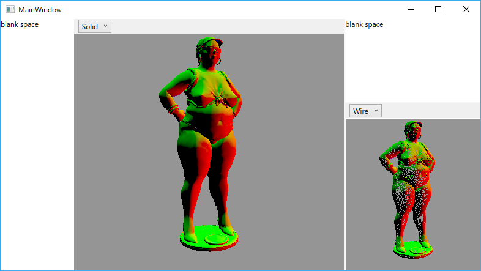

# SandBoxWPF
WPFのサンドボックスプロジェクト  

WPFとSharpDXを使ったミニマムな実験アプリ等を作るきっかけに出来そうなミニマムプロジェクトです。  

- 取りあえずD3D11で複数コントロールに描画できます  
- FBXファイルの読み込み(Assimpで読めるものは多分全部対応していると思います)  
- 他は何もありません(RX入れていてもマウス追跡はまだ書けていません)  

SharpDX、Assimp、ReactiveProperty他多くのNuGetのプロジェクトにお世話になっております。
